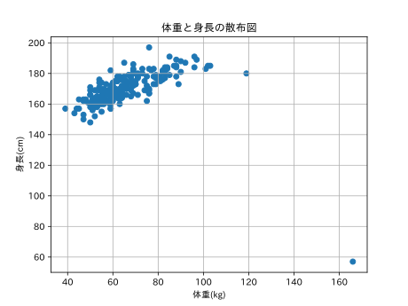
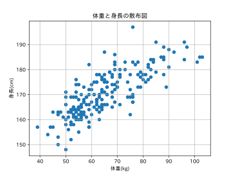
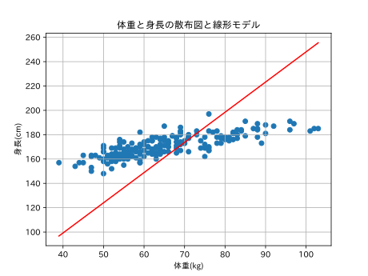
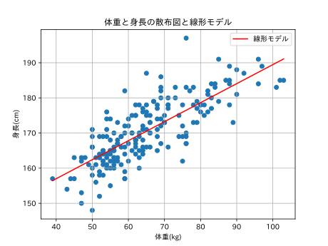

# 📊 Simple Regression Analysis
体重（kg）から身長（cm）を予測する**単純線形回帰**を、勾配降下法で手動実装したプロジェクトです。  
**正規化なし**と**正規化あり**の2パターンを実装し、**学習率や勾配のスケール差が学習の収束に与える影響**を可視化します。

---

## 📁 使用データ

- **データセット**: [Davis dataset](https://vincentarelbundock.github.io/Rdatasets/csv/carData/Davis.csv)（身長・体重の実測値）
- **前処理**: 体重が 110 kg 以上のデータを外れ値として除去しています。

| 外れ値あり | 外れ値除去後 |
|:---:|:---:|
|  |  |

---

## 🧮 モデル

予測モデルは以下の通りです：

$$ \hat{y} = ax + b $$

| 記号 | 意味 |
|:---:|:---|
| $x$ | 体重（kg） |
| $\hat{y}$ | 予測身長（cm） |
| $a$ | **傾き**（学習対象） |
| $b$ | **切片**（学習対象） |

**損失関数（平均二乗誤差: MSE）**:

$$ L = \frac{1}{n} \sum_{i=1}^{n} (y_i - \hat{y}_i)^2 $$

**パラメーターの勾配**:

$$ \frac{\partial L}{\partial a} = \frac{-2}{n} \sum_{i=1}^{n} x_i (y_i - \hat{y}_i), \quad \frac{\partial L}{\partial b} = \frac{-2}{n} \sum_{i=1}^{n} (y_i - \hat{y}_i) $$

---

## 📂 ファイル構成

```text
simple-regression-analysis/
├── learning_without_normalization.py   # 正規化なしで学習
├── learning_with_normalization.py      # 正規化ありで学習
├── output_without_normalization/       # 正規化なしの出力結果
│   ├── learning_results.txt
│   ├── mse_transition.svg
│   └── scatter_epoch_*.svg
└── output_with_normalization/          # 正規化ありの出力結果
    ├── learning_results.txt
    ├── mse_transition.svg
    └── scatter_epoch_*.svg
```

---

## 🧪 実験 1：正規化なし（`learning_without_normalization.py`）

### ⚙️ 設定

| パラメーター | 値 |
|:---|:---|
| **学習率 `eta`** | `0.00002` |
| **エポック数** | `20` |
| **初期値** | $a = 0,\ b = 0$ |

### ⚠️ 問題：勾配スケールの不均衡

傾き $a$ の勾配 `da` には $x_i$（体重：約 40〜110 kg）が掛けられている一方、切片 $b$ の勾配 `db` には掛けられていません。

```python
da += -2 * xi * (yi - pred_height)   # xi ≈ 40〜110 が掛かる
db += -2 *      (yi - pred_height)   # スケールなし
```

このため、**`da` は `db` に比べてスケールが数百倍大きく**なります。  
共通の小さな学習率 `eta = 0.00002` で更新を行うと、$a$ だけが急速に更新されてしまいます。

> [!WARNING]
> **結果として**  
> $b$ が適切な値（約 135 前後）に到達する前に、$a$ が「$b = 0$ の条件下での最適な値」に落ち着いてしまい、**損失関数もそこで「収束した」と見なされてしまう（偽の収束）**という問題が発生します。

### 📈 学習結果

> **最終的なパラメーター**: `a = 2.491`, `b = 0.041`

| エポック | $a$ | $b$ | MSE |
|:---:|:---:|:---:|:---:|
| 1 | 0.447 | 0.0068 | 29163.7 |
| 10 | 2.176 | 0.0342 | 1586.1 |
| 20 | **2.491** | **0.041** | 726.2 |

$a$ は急速に更新されているのに対し、$b$ はほぼ `0` のままです。  
出力された `scatter_epoch_20.svg` を確認すると、回帰直線が原点付近を通る不自然な結果となっています。



---

## 🧪 実験 2：正規化あり（`learning_with_normalization.py`）

### ⚙️ 設定

体重・身長をそれぞれ **平均 0・標準偏差 1** に正規化してから学習を行います。

```python
df_norm['weight'] = (df_norm['weight'] - mean_w) / std_w
df_norm['height'] = (df_norm['height'] - mean_h) / std_h
```

| パラメーター | 値 |
|:---|:---|
| **学習率 `eta`** | `0.1` |
| **エポック数** | `20` |
| **初期値** | $a_{\text{norm}} = 0,\ b_{\text{norm}} = 0$ |

> [!NOTE]
> 正規化後は $x_i$ のスケールが約 `-2` 〜 `+2` に収まるため、`da` と `db` のスケール差が大幅に解消されます。

### 🔄 逆変換

正規化された空間で学習したパラメーターを、元のスケールに戻すための変換式です。

$$ a_{\text{orig}} = a_{\text{norm}} \cdot \frac{\sigma_h}{\sigma_w} $$

$$ b_{\text{orig}} = \sigma_h \left( b_{\text{norm}} - a_{\text{norm}} \cdot \frac{\mu_w}{\sigma_w} \right) + \mu_h $$

- **`orig`**: Original（元のスケール）
- **`norm`**: Normalized（正規化されたスケール）

### 📈 学習結果

> **最終的なパラメーター**: `a = 0.541`, `b = 135.360`

| エポック | $a$ | $b$ | MSE（正規化空間） |
|:---:|:---:|:---:|:---:|
| 1 | 0.109 | 163.46 | 0.9949 |
| 10 | 0.488 | 138.81 | 0.3942 |
| 20 | **0.541** | **135.36** | 0.3831 |

$b$ が適切な値（約 135 前後）に到達しており、データの正規化が勾配降下法に与える良い効果が明確に確認できます。



---

## 📋 まとめ：正規化なし vs 正規化あり

| 項目 | 正規化なし | 正規化あり |
|:---|:---|:---|
| **学習率** | `0.00002` | `0.1` |
| **最終的な $a$** | `2.491` | `0.541` |
| **最終的な $b$** | **`0.041`** （ほぼ 0） | **`135.36`** （適切な切片） |
| **MSE の状態** | `726.2` （偽の収束） | `0.383` （正常な収束） |
| **問題点** | `da` と `db` のスケール差により $b$ が更新されない | 勾配のスケールが揃い、両パラメーターが適切に更新される |

---

## 💻 環境・依存ライブラリ

- Python 3.10+
- `pandas`
- `matplotlib`
- `japanize-matplotlib`

**インストール**:

```bash
pip install pandas matplotlib japanize-matplotlib
```

---

## 🚀 実行方法

```bash
# 正規化なしの実行
python learning_without_normalization.py

# 正規化ありの実行
python learning_with_normalization.py
```

各スクリプトを実行すると、対応する `output_*/` ディレクトリに以下のファイルが出力されます：

- `learning_results.txt` : 各エポックのパラメーターと MSE
- `scatter_epoch_*.svg` : 各エポックの散布図と回帰直線
- `mse_transition.svg` : MSE の推移グラフ
